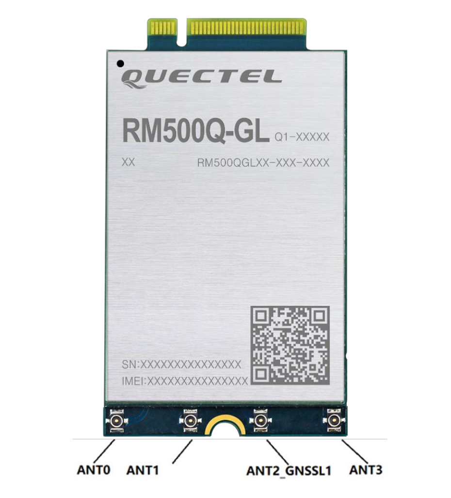

# Introduction

In this project we will see how to configure and run a 5G end-to-end
setup using SDRs and
[Openairinterface5G](https://gitlab.eurecom.fr/oai/openairinterface5g),
an Open Source software. For this reason, we will need to configure:

-   ```OAI CN5G```. The core network of the 5G Network that we will be
    setting up. Hence, a database will be required to be able to
    register SIM's as a normally done in cellular networks for
    controlling data, traffic, and so on.

-   ```OAI gNB```. The 3GPP 5G Next Generation base station which supports
    the *5G NR* (*5G New Radio*). Hence, we will setup the base station
    and configure it to be able to integrate the SDR, specifically, an
    URSPB200-mini.

-   ```Quectel RM500Q-GL + Quectel 5G-M2 EVB```. A 5G module will be
    required to test the 5G Network Setup, being able to test the
    association between the 5G module (with a SIM) and the gNB (base
    station). this module and evaluation board will be used as UE (user
    equipment).

# Software architecture

## 5G implementation

For the project, we will need to configure and run a 5G end-to-end setup
using SDRs and
[Openairinterface5G](https://gitlab.eurecom.fr/oai/openairinterface5g),
an Open Source software. For this reason, we will need to configure:

-   *OAI CN5G*. The core network of the 5G Network that we will be
    setting up. Hence, a database will be required to be able to
    register SIM's as a normally done in cellular networks for
    controlling data, traffic, and so on.

-   *OAI gNB*. The 3GPP 5G Next Generation base station which supports
    the *5G NR* (*5G New Radio*). Therefore, we will setup the base
    station and configure it to be able to integrate the SDR,
    specifically, an URSPB200-mini.

-   *Quectel RM500Q-GL + Quectel 5G-M2 EVB*. A 5G module will be
    required to test the 5G Network Setup, being able to test the
    association between the 5G module (with a SIM) and the gNB (base
    station). This module and evaluation board will be used as UE (user
    equipment).

### OAI CN5G

#### Setup

> **Warning**
> It is crucial to work within a native **python3 environment**. For example, testing OAI within an Anaconda environment the setup could not be completed due to multiple environment dependencies errors.

First of all, we will need to install the necessary tools and
dependencies:

```shell
sudo apt install -y git net-tools putty

sudo apt install -y apt-transport-https ca-certificates curl software-properties-common
curl -fsSL https://download.docker.com/linux/ubuntu/gpg | sudo apt-key add -
sudo add-apt-repository "deb [arch=amd64] https://download.docker.com/linux/ubuntu $(lsb_release -cs) stable"
sudo apt update
sudo apt install -y docker docker-ce

# Add your username to the docker group, otherwise you will have to run in sudo mode.
sudo usermod -a -G docker $(whoami)
reboot

# https://docs.docker.com/compose/install/
sudo curl -L "https://github.com/docker/compose/releases/download/v2.12.2/docker-compose-$(uname -s)-$(uname -m)" -o /usr/local/bin/docker-compose
sudo chmod +x /usr/local/bin/docker-compose
```

](figures/3GPP-5G-sys-arch.png)5G System Architecture

Then, we need to clone the `oai-cn5g-fed` repository and pull and tag
all the docker images. All these containers represent the
components/modules defined at the 5G architecture:

```shell
# Git oai-cn5g-fed repository
git clone https://gitlab.eurecom.fr/oai/cn5g/oai-cn5g-fed.git ~/oai-cn5g-fed

# Pull docker images
docker pull oaisoftwarealliance/oai-amf:develop
docker pull oaisoftwarealliance/oai-nrf:develop
docker pull oaisoftwarealliance/oai-smf:develop
docker pull oaisoftwarealliance/oai-udr:develop
docker pull oaisoftwarealliance/oai-udm:develop
docker pull oaisoftwarealliance/oai-ausf:develop
docker pull oaisoftwarealliance/oai-spgwu-tiny:develop
docker pull oaisoftwarealliance/trf-gen-cn5g:latest

# Tag docker images
docker image tag oaisoftwarealliance/oai-amf:develop oai-amf:develop
docker image tag oaisoftwarealliance/oai-nrf:develop oai-nrf:develop
docker image tag oaisoftwarealliance/oai-smf:develop oai-smf:develop
docker image tag oaisoftwarealliance/oai-udr:develop oai-udr:develop
docker image tag oaisoftwarealliance/oai-udm:develop oai-udm:develop
docker image tag oaisoftwarealliance/oai-ausf:develop oai-ausf:develop
docker image tag oaisoftwarealliance/oai-spgwu-tiny:develop oai-spgwu-tiny:develop
docker image tag oaisoftwarealliance/trf-gen-cn5g:latest trf-gen-cn5g:latest
```

Lastly, we copy a pair of configuration files (the main configuration
file and the database) to their respective paths.

-   Copy `docker-compose-basic-nfr.yaml` to
    ` /oai-cn5g-fed/docker-compose`

    ```shell
    wget -O ~/oai-cn5g-fed/docker-compose/docker-compose-basic-nrf.yaml
    https://gitlab.eurecom.fr/oai/openairinterface5g/-/raw/develop/doc/tutorial_resources/docker-compose-basic-nrf.yaml?inline=false
    ```

-   Copy `oai_db.sql` to ` /oai-cn5g-fed/docker-compose/database`

    ```shell
        wget -O ~/oai-cn5g-fed/docker-compose/database/oai_db.sql
        https://gitlab.eurecom.fr/oai/openairinterface5g/-/raw/develop/doc/tutorial_resources/oai_db.sql?inline=false
    ```

> **Note**
> In the event of having a SIM Card Programmer, we can modify its internal parameters using the application [uicc-v2.6](https://open-cells.com/d5138782a8739209ec5760865b1e53b0/uicc-v2.6.tgz) from [Open Cells Project](https://open-cells.com/). Otherwise, we will need to have an already programmed SIM and modify the CN database values to fit into SIM ones:

```shell
  sudo ./program_uicc --adm 12345678 --imsi 001010000000001 --isdn
  00000001 --acc 0001 --key fec86ba6eb707ed08905757b1bb44b8f --opc
  C42449363BBAD02B66D16BC975D77CC1 -spn "OpenAirInterface"
  --authenticate
```

#### Configuration

Once having OAI CN5G installed with the default setup, we will need to
change the default configuration with our specific configuration.
Briefly, OpenAirInterface5G has virtualized all the components/modules
of the 5G system architecture, in
specific, every component has been implemented in its own docker
container. Hence, its is important not only to configure the 5G network
(MCC, MNC, \...) but we also need to check the connection between the
docker containers, each with its own configuration file.

From now on, we will consider that we have an already programmed SIM and
we need to adapt the CN5G to it.

First, we will modify the main configuration file
(`docker-compose-basic-nfr.yaml`) to:

-   [Change MCC and MNC values according to the programmed SIM
    card]{.underline}. In our case, `<MCC_SIM>` and `<MNC_SIM>` are 208
    and 92, respectively.

    From the `oai-amf` and `oai-spgwu` services, we will need to set
    properly the following fields:

    -   `oai-amf`:

        -   `MCC = <MCC_SIM>`

        -   `MNC = <MNC_SIM>`

        -   `SERVED_GUAMI_MCC_0 = <MCC_SIM>`

        -   `SERVED_GUAMI_MNC_0 = <MNC_SIM>`

        -   `PLMN_SUPPORT_MCC = <MCC_SIM>`

        -   `PLMN_SUPPORT_MNC = <MNC_SIM>`

    -   `oai-spgwu`:

        -   `MCC = <MCC_SIM>`

        -   `MNC = <MNC_SIM>`

-   For the authentication procedure to suceed we need to add the
    information of our SIM card to the database. We can follow two
    strategies:

    1.  Before starting the CN5G and creating the docker containers, we
        can modify the default configuration file
        ( /oai-cn5g-fed/docker-compose/oai_db.sql):

    2.  If the docker containers have already been created, we can
        access the `mysql` container and update or insert new UE
        subscriptions to the database. The info can be inserted using
        the mysql command line client:

        ::: listing
        ```shell
            sudo mysql -h 192.168.70.131 -u test -p
            Enter password: test

            mysql> USE oai_db;

            mysql> INSERT INTO `AuthenticationSubscription` (`ueid`,
        `authenticationMethod`, `encPermanentKey`, `protectionParameterId`,
        `sequenceNumber`, `authenticationManagementField`, `algorithmId`,
        `encOpcKey`, `encTopcKey`, `vectorGenerationInHss`, `n5gcAuthMethod`,
        `rgAuthenticationInd`, `supi`) VALUES (...);

            mysql> INSERT INTO `SessionManagementSubscriptionData` (`ueid`,
            `servingPlmnid`, `singleNssai`, `dnnConfigurations`) VALUES (...);

            mysql> exit;
        ```
        :::

#### Starting the CN5G

Lastly, we can run the CN5G executing the following commands:

```shell
cd ~/oai-cn5g-fed/docker-compose
python3 core-network.py --type start-basic --scenario 1
```

### OAI gNB

The gNB (base station) must also be installed and configured. We
installed it on the same PC as the core network, to facilitate the
communication between them.

#### Setup

There are some prerequisites to set up the base station. First of all,
we need to build the [UHD drivers](https://github.com/EttusResearch/uhd)
(free & open-source software driver and API for the Universal Software
Radio Peripheral SDR platform). This can be done using the following
commands:

```shell
sudo apt install -y libboost-all-dev libusb-1.0-0-dev doxygen python3-docutils python3-mako python3-numpy python3-requests python3-ruamel.yaml python3-setuptools cmake build-essential

git clone https://github.com/EttusResearch/uhd.git ~/uhd
cd ~/uhd
git checkout v4.3.0.0
cd host
mkdir build
cd build
cmake ../
make -j \$(nproc)
make test # This step is optional
sudo make install
sudo ldconfig
sudo uhd\_images\_downloader
```

Once this step has been completed, we can proceed and build the OAI gNB:

```shell
# Get openairinterface5g source code
git clone https://gitlab.eurecom.fr/oai/openairinterface5g.git ~/openairinterface5g
cd ~/openairinterface5g
git checkout develop

# Install OAI dependencies
cd ~/openairinterface5g
source oaienv
cd cmake\_targets
./build\_oai -I

# Build OAI gNB
cd ~/openairinterface5g
source oaienv
cd cmake\_targets
./build\_oai -w USRP --ninja --nrUE --gNB --build-lib all -c
```

#### Configuration

In order to get the base station to work, some changes must be made to
the default configuration, so we modified the
`gnb.sa.band78.fr1.106PRB.usrpb210.conf` file. This configuration file
changes depending on the band and SDR being used. In our case we are
using the n78 band and the USRP B200 SDR, and we modified some extra
settings:

-   Set the proper MCC and MNC, in this case 208 and 92, respectively.

-   Check that the gNB and AMF IPs are properly set. In our case, we had
    to change the gNB IPs shown in the file to $192.168.1.129/24$. The
    AMF IP was already set correctly by default ($192.168.1.132/24$, the
    IP of the AMF docker container).

#### Starting the gNB

The starting procedure depends on the SDR used and the band. In our
case, for the USRP B200 and band 78 we used the following commands:

```shell
cd ~/openairinterface5g
source oaienv
cd cmake_targets/ran_build/build
sudo ./nr-softmodem -O ../../../targets/PROJECTS/GENERIC-NR-5GC/CONF/gnb.sa.band78.fr1.106PRB.usrpb210.conf --sa -E --continuous-tx
```

### UE: Quectel RM500Q-GL + EVB

The Quectel RM500Q-GL is a 5G module optimized specially for IoT/eMBB
applications. It supports both 5G NSA and SA modes, and it comes with an
evaluation board for testing and debugging purposes. The important
things that the EVB has are:

-   USB-C port to provide power and connection to the serial port. It is
    used to send AT commands to configure the module. For power it also
    has a DC barrel jack input. Both must be connected, as the USB does
    not provide enough power to the evaluation board.

-   Ethernet expansion card. It allows us to use the board as a modem
    through an Ethernet cable.

-   Coaxial connectors and cables for up to 6 antennas. In this case,
    the module only uses four of them. The antenna pins must be connected to the antennas
    using the cables provided by the evaluation board cables.

    <figure id="img:ModuleAntenna">
    <div class="center">
    
    </div>
    <figcaption>RM500Q-GL antenna pins.</figcaption>
    </figure>

    <figure id="img:ModuleAntennaMapping">
    <div class="center">
    
    </div>
    <figcaption>RM500Q-GL antenna mapping.</figcaption>
    </figure>

#### Pre-configuration

If it is meant to be used in Windows, we need all the drivers that are
available to download in the Quectel official web.

Although Windows is recommended by OpenAirInterface5G, it is also
possible to setup the module with Ubuntu, and it doesn't even need
special drivers to work with.

#### Setup

All the AT commands have to be sent through the serial port with 115200
baudrate and 1 stop bit. It is recommended to use "Cutecom", a graphical
serial terminal.

```shell
# MUST be sent at least once everytime there is a firmware upgrade!
AT+QMBNCFG="Select","ROW_Commercial"
AT+QMBNCFG="AutoSel",0
AT+CFUN=1,1
AT+CGDCONT=1,"IP","oai"
AT+CGDCONT=2
AT+CGDCONT=3

# (Optional, debug only, AT commands) Activate PDP context, retrieve IP address and test with ping
AT+CGACT=1,1
AT+CGPADDR=1
AT+QPING=1,"openairinterface.org"
```

First of all, we need to configure which SIM slot will be used. The
command to change the slot is "AT+QUIMSLOT=$<$num$>$", in which
"$<$num$>$" has to be the number of the slot to be used (1 or 2).

Then we need to enable both the SIM card detection and insertion status
report with the commands "AT+QSIMDET=1,1" and "AT+QSIMSTAT=1"
respectively. This is needed in order to force a reconnection from the
UE to the base station by removing and inserting the SIM.

Finally, once enabling and setting up everything, as we can see, we have
been able to successfully setup a 5G network.


> **Warning** 
> If the default OAI Quectel setup does not work, for example, an error `561` in a `QPING` AT command, it is most likely to be an error with the activation of the `PDP CONTEXT`. Hence, using `AT+QIACT=1,1` it solved the problem, activating the `PDPCONTEXT`. The `AT+CGACT=1,1` command shown in the previous listing should work exactly the same way.

#### NetworkManager setup

Once having the Quectel succesfully connected to the base station and
being able to establish a communication, we will configure the Quectel
module as a 5G modem for a host machine. Hence, we will have to
configure `NetworkManager (nmcli)` to add a new *GSM* connection.
Briefly, we will create a new configuration file in
` /etc/NetworkManager/system-connections` with the `*.nmconnection`
extension. Specifically, using PPP (Point-to-Point Protocol) for
establishing a connection with the Quectel module over the GSM network
via serial interface between the modem and th host machine. As a result, we have successfully established a connection between a host machine via the Quectel modem to the base station.

```shell
[connection]
id=quectel-oai-ppp
type=gsm
autoconnect=false

[gsm]
apn=oai
device=/dev/ttyUSB0

[ppp]
lcp-echo-failure=5
lcp-echo-interval=30
user=
password=

[ipv4]
method=auto

[ipv6]
addr-gen-mode=stable-privacy
method=auto
```

<figure id="fig:5gresult">
<figure id="fig:hostmachine">

<figcaption>Host machine (client)</figcaption>
</figure>
<figure id="fig:gnbnmcli">

<figcaption>Wireshark capture (gNB)</figcaption>
</figure>
<figcaption>A connection between a client and the 5G base station (gNB)
</figcaption>
</figure>

> **Note** 
> We encountered issues when connecting the Quectel RM500Q-GL modem to a regular laptop. Despite checking the compatibility of kernel versions and operating systems, the modem was never detected on the laptops for unknown reasons.

# Hardware architecture

## 5G network

In research studies, having a controlled environment and the ability to
manipulate conditions is important. However, when working within a 5G
network that operates through radiofrequency, it is evident that
interferences can occur, and the behavior of the network may not remain
constant. Consequently, the environment becomes practically
uncontrolled.


Hence, the previous figure represents a wired 5G network with a base
station (based on the platform *USRP B200mini*) along with multiple 5G
IoT modems (*Quectel RM500Q-GL*) that will establish connections with
clients. This particular 5G network, provides us a complete control over
the network, also minimizing external interference. This configuration
allows us to modify individual client conditions, such as manipulating
the modulation of each client by attenuating the received signal, among
other possibilities. As a result, we can see the final 5G network setup,
with the corresponding signal attenuation and power splitting across all
the 5G IoT modems.

Finally, while the setup mentioned earlier provides an environment with
absolute control, it also lacks the flexibility and realism of a typical
5G network. In this setup, all clients must be in close proximity to
each other. Additionally, the complexity of the
setup increases as it requires additional equipment such as power
splitters, attenuators, and coaxial cables. These components are
necessary to establish the wired connections and manipulate the
conditions of each client. The addition of such equipment adds to the
overall complexity and infrastructure requirements of the setup.


